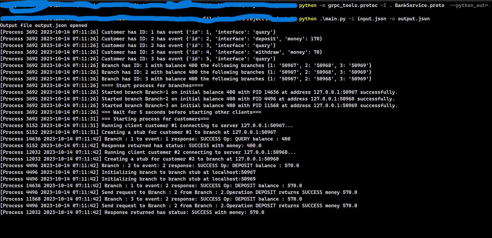

## PROJECT 1
---------------------------
### SETUP FOR WINDOWS

1. Install git (version **2.40.1.windows.1**}) [Windows](https://git-scm.com/download/win)
2. Install python version **3.9.13** [Windows](https://www.python.org/downloads/). Ensure python is accessible via [Powershell](https://learn.microsoft.com/en-us/windows/python/beginners)
3. Install pip version **23.2.1**``` py -m ensurepip --upgrade ``` [Source](https://pip.pypa.io/en/stable/installation/)
4. Create a new [virtual environment](https://packaging.python.org/en/latest/guides/installing-using-pip-and-virtual-environments/) for pip and install the following packages
   - grpcio==1.59.0
   - grpcio-tools==1.33.2
   - protobuf==3.14.0
5. Activate the newly created environment
6. Clone the repository [CSE-531-Project](https://github.com/codlocker/CSE-531-Project)
   - ```git clone https://github.com/codlocker/CSE-531-Project.git``` 

### RUN INSTRUCTIONS
1. Run the command ```cd CSE-531-Project/Project 1``` after cloning
2. Run the following the command the build the proto files: ```python -m grpc_tools.protoc -I . .\BankService.proto  --python_out=. --grpc_python_out=.```
3. The entry point of the code is through main.py
   - -i 'Input file path'
   - -o 'Output file path'
   - Example command : python main.py -o output.json -i input.json
  
### RESULTS

- On running the [input.json](./Project%201/input.json), the output is as follows : [output.json](./Project%201/output.json)
- On running the [input1.json](./Project%201/input1.json), the output is as follows : [output1.json](./Project%201/output1.json)


